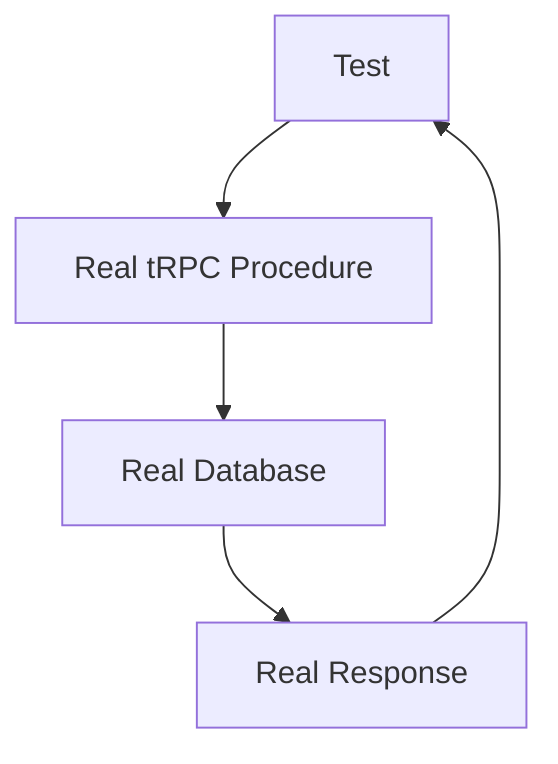

# Test Setup with Bun Testing Library

## Overview

Simple, practical testing setup for Athena AI server using Bun's native testing framework. Focus on integration tests that verify real code behavior with your actual database - no mocks, no complexity.

## Technology Stack & Dependencies

### Core Testing Technologies

- **Bun Test**: Native testing framework with built-in test runner and assertions
- **@hono/testing**: Hono's type-safe testing utilities
- **Real Test Database**: Your provided test database for authentic integration testing

## Simple Testing Architecture

### Directory Structure

```
server/
├── src/
│   ├── __tests__/
│   │   ├── setup.ts
│   │   ├── chat.test.ts
│   │   ├── auth.test.ts
│   │   ├── library.test.ts
│   │   └── organization.test.ts
│   └── [existing structure]
```

That's it. No complex hierarchies, no elaborate patterns.

## Test Configuration

### Bun Test Configuration

```toml
# bunfig.toml
[test]
timeout = 30000
preload = ["./src/__tests__/setup.ts"]

[test.env]
NODE_ENV = "test"
DATABASE_URL = "your-provided-test-db-url"
```

### Simple Test Setup

```typescript
// src/__tests__/setup.ts
import { beforeEach, afterAll } from "bun:test";
import { drizzle } from "drizzle-orm/postgres-js";
import postgres from "postgres";
import { env } from "../config/env";
import * as schema from "../db/schemas";

// Simple test database connection
const testConnection = postgres(env.DATABASE_URL);
export const testDb = drizzle(testConnection, { schema });

// Clean slate before each test - fast and simple
beforeEach(async () => {
  // Truncate all tables in dependency order
  await testDb.delete(schema.chatMessages);
  await testDb.delete(schema.chatSessions);
  await testDb.delete(schema.libraryItems);
  await testDb.delete(schema.organizationMembers);
  await testDb.delete(schema.organizations);
  await testDb.delete(schema.users);
});

afterAll(async () => {
  await testConnection.end();
});
```

## Testing Approach

### Integration Tests Only

Focus on testing complete workflows that verify your actual business logic works correctly.



No mocks. No unit tests. Just real code doing real things.

## Test Implementation Patterns

### tRPC Procedure Testing (The Right Way)

```typescript
// src/__tests__/chat.test.ts
import { test, expect } from "bun:test";
import { createCallerFactory } from "@trpc/server";
import { appRouter } from "../trpc";
import { createTRPCContext } from "../trpc/base";
import { testDb } from "./setup";
import { users, organizations } from "../db/schemas";

test("complete chat workflow", async () => {
  // Create real test data
  const [user] = await testDb
    .insert(users)
    .values({
      email: "test@example.com",
      name: "Test User",
    })
    .returning();

  const [org] = await testDb
    .insert(organizations)
    .values({
      name: "Test Org",
      ownerId: user.id,
    })
    .returning();

  // Create real tRPC context
  const context = await createTRPCContext({
    req: new Request("http://localhost/trpc"),
    resHeaders: new Headers(),
  });

  // Override with test user
  context.user = user;

  // Test real tRPC procedures
  const createCaller = createCallerFactory(appRouter);
  const caller = createCaller(context);

  // Create chat session
  const session = await caller.chat.createSession({
    title: "Test Chat",
    organizationId: org.id,
  });

  expect(session.id).toBeDefined();
  expect(session.title).toBe("Test Chat");

  // Send a message
  const message = await caller.chat.sendMessage({
    sessionId: session.id,
    message: "Hello AI",
    organizationId: org.id,
  });

  expect(message.content).toBe("Hello AI");

  // Verify it's actually in the database
  const savedMessages = await testDb
    .select()
    .from(schema.chatMessages)
    .where(eq(schema.chatMessages.sessionId, session.id));

  expect(savedMessages).toHaveLength(1);
  expect(savedMessages[0].content).toBe("Hello AI");
});
```

### Hono Route Testing (When Needed)

```typescript
// src/__tests__/auth.test.ts
import { test, expect } from "bun:test";
import { testClient } from "hono/testing";
import { app } from "../server";

test("health endpoint works", async () => {
  const client = testClient(app);

  const res = await client.health.$get();
  expect(res.status).toBe(200);

  const body = await res.json();
  expect(body.status).toBe("ok");
});

test("auth routes are protected", async () => {
  const client = testClient(app);

  // Test without auth header
  const res = await client.api.auth.session.$get();
  expect(res.status).toBe(401);
});
```

### Database Testing (Direct and Simple)

```typescript
// src/__tests__/library.test.ts
import { test, expect } from "bun:test";
import { testDb } from "./setup";
import { users, libraryItems } from "../db/schemas";
import { eq } from "drizzle-orm";

test("library item creation and retrieval", async () => {
  // Create test user
  const [user] = await testDb
    .insert(users)
    .values({
      email: "test@example.com",
      name: "Test User",
    })
    .returning();

  // Create library item
  const [item] = await testDb
    .insert(libraryItems)
    .values({
      title: "Test Document",
      content: "This is test content",
      userId: user.id,
      type: "document",
    })
    .returning();

  expect(item.title).toBe("Test Document");
  expect(item.userId).toBe(user.id);

  // Retrieve and verify
  const retrieved = await testDb
    .select()
    .from(libraryItems)
    .where(eq(libraryItems.id, item.id))
    .limit(1);

  expect(retrieved).toHaveLength(1);
  expect(retrieved[0].content).toBe("This is test content");
});
```

### Organization Testing

```typescript
// src/__tests__/organization.test.ts
import { test, expect } from "bun:test";
import { createCallerFactory } from "@trpc/server";
import { appRouter } from "../trpc";
import { createTRPCContext } from "../trpc/base";
import { testDb } from "./setup";
import { users } from "../db/schemas";

test("organization creation and membership", async () => {
  // Create test user
  const [user] = await testDb
    .insert(users)
    .values({
      email: "owner@example.com",
      name: "Owner User",
    })
    .returning();

  const context = await createTRPCContext({
    req: new Request("http://localhost/trpc"),
    resHeaders: new Headers(),
  });
  context.user = user;

  const createCaller = createCallerFactory(appRouter);
  const caller = createCaller(context);

  // Create organization
  const org = await caller.organization.create({
    name: "Test Organization",
  });

  expect(org.name).toBe("Test Organization");
  expect(org.ownerId).toBe(user.id);

  // Invite member
  const invitation = await caller.organization.inviteMember({
    organizationId: org.id,
    email: "member@example.com",
  });

  expect(invitation.email).toBe("member@example.com");
  expect(invitation.organizationId).toBe(org.id);
});
```

## Test Execution

### Package.json Scripts

```json
{
  "scripts": {
    "test": "bun test",
    "test:watch": "bun test --watch"
  }
}
```

### Running Tests

```bash
# Run all tests
bun test

# Run specific test file
bun test src/__tests__/chat.test.ts

# Watch mode for development
bun test --watch

# Run with coverage
bun test --coverage
```

## External API Handling

For the few external APIs you can't avoid (OpenAI, web search), use environment variables to switch between real and test endpoints:

```typescript
// Only mock what you absolutely must
const openai = new OpenAI({
  apiKey: env.OPENAI_API_KEY,
  baseURL:
    env.NODE_ENV === "test"
      ? "http://localhost:3001/mock-openai" // Simple mock server
      : undefined,
});
```

Keep it minimal. Test your code, not external services.

## Key Principles

1. **Integration Over Unit**: Test complete workflows, not isolated functions
2. **Real Database**: Use your actual test database, not mocks
3. **Simple Structure**: Flat test directory, no complex hierarchies
4. **Fast Cleanup**: Truncate tables between tests for speed
5. **Type Safety**: Leverage tRPC and Hono's type safety in tests
6. **Minimal Mocking**: Only mock external APIs you can't control

This approach gives you confidence in your code without the overhead of complex testing architectures.
