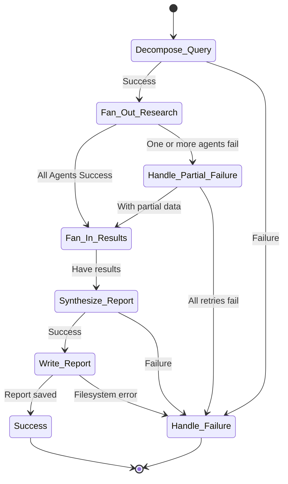

# Backend Architecture: Orchestration & Concurrency

**Version:** 1.0
**Author:** T3 Chat
**Status:** In Progress

---

## 1. Introduction

This document details the orchestration and concurrency patterns for the Athena v1 backend. The core of the system is the Mastra orchestrator, which is responsible for managing the "Deep Research" workflow in a structured, stateful, and resilient manner.

---

## 2. Orchestration Flow

The "Deep Research" workflow is modeled as a state graph within Mastra. This approach provides clear, debuggable steps and allows for robust state management and error handling. The primary states and transitions are visualized below.

### Orchestration State Diagram



### State Descriptions

1.  **Decompose Query**: The initial user prompt is analyzed by an LLM to break it down into a list of distinct, parallelizable research tasks.
2.  **Fan-Out Research**: The orchestrator spawns multiple child agents, one for each research task. These agents execute concurrently.
3.  **Handle Partial Failure**: If an agent fails, the orchestrator's built-in retry logic is triggered (once per PRD). If retries fail, it proceeds with the successful results.
4.  **Fan-In Results**: The orchestrator waits for all active research agents to complete (or fail their retries) and aggregates their structured data outputs into a single state object.
5.  **Synthesize Report**: A final agent receives the aggregated data and generates a polished, cohesive Markdown report.
6.  **Write Report**: The generated Markdown is written to the `output/` directory on the local filesystem.
7.  **Handle Failure / Success**: Terminal states that log the final outcome and provide a clear status to the user.

---

## 3. Concurrency Pattern (v1)

For the initial v1 release, concurrency is handled **in-process** using the Effect-TS fiber model. This provides a structured, composable, and resilient approach to managing concurrent operations within the Bun runtime, moving beyond simple `Promise`-based patterns.

### Structured Concurrency with Effect Fibers

The "Fan-Out Research" step leverages Effect's structured concurrency capabilities to execute child research agents in parallel. Instead of raw promises, each agent's execution is wrapped in an `Effect`. This allows for fine-grained, typed error handling.

We can define a schema for our possible errors, allowing the compiler to ensure we handle each case.

```typescript
// Pseudocode for the Fan-Out Research step using Effect
import { Effect, Data } from "effect";
import { Schema } from "@effect/schema";

// Define a structured, typed error model
class AgentTimeoutError extends Data.TaggedError("AgentTimeoutError")<{
  message: string;
}> {}

class AgentApiError extends Data.TaggedError("AgentApiError")<{
  cause: unknown;
}> {}

class AgentValidationError extends Data.TaggedError("AgentValidationError")<{
  errors: ReadonlyArray<string>;
}> {}

type AgentError = AgentTimeoutError | AgentApiError | AgentValidationError;

// Represents an agent run as a composable Effect
function createResearchEffect(
  task: ResearchTask
): Effect.Effect<Result, AgentError> {
  return Effect.tryPromise({
    try: () => researchAgent.run(task.prompt),
    catch: (error) => new AgentApiError({ cause: error }),
  }).pipe(
    // Add other operators like timeouts
    Effect.timeout("10 seconds"),
    Effect.mapError(
      () => new AgentTimeoutError({ message: "Agent took too long" })
    )
  );
}

function runResearchInParallel(
  tasks: ResearchTask[]
): Effect.Effect<Result[], AgentError> {
  // 1. Map each task to an Effect
  const agentEffects = tasks.map(createResearchEffect);

  // 2. Run all effects in parallel using Effect.all
  // This configuration gathers all successes and all failures,
  // aligning with the "Handle_Partial_Failure" state.
  return Effect.all(agentEffects, {
    concurrency: "unbounded",
    mode: "validate",
  }).pipe(
    Effect.mapError(([firstError, ...otherErrors]) => firstError) // Example: just forward the first error
  );
}
```

This model provides several key advantages:

- **Structured Concurrency**: Fibers are scoped to the `Effect` that creates them. If the parent `Effect` is interrupted, all child fibers are automatically and reliably interrupted as well. This prevents resource leaks.
- **Composable**: Effects can be easily combined, retried, and timed out using a rich set of operators. The example above shows a `timeout` operator.
- **Typed Errors**: The `Effect` type includes an error channel (`Effect<SuccessType, ErrorType>`). By defining a union of error classes (e.g., `AgentError`), we can use the type system to ensure all potential failures are handled explicitly, making the system more robust.
- **Resilience**: Using `Effect.all` with `{ mode: 'validate' }` allows us to collect all successful results even if some effects fail, aligning perfectly with the `Handle_Partial_Failure` state.

This approach offers robust error handling and cancellation semantics out-of-the-box, making the system more reliable and easier to reason about compared to traditional `Promise.all` patterns.
