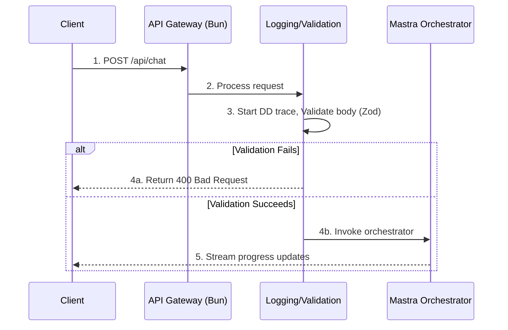

# Backend Architecture: API & Error Handling

**Version:** 1.0
**Author:** T3 Chat
**Status:** In Progress

---

## 1. Introduction

This document specifies the API design, agent communication patterns, and error handling strategies for the Athena v1 backend. A well-defined API contract and robust error handling are critical for creating a reliable and debuggable system.

---

## 2. API Design

The backend exposes a simple, resource-oriented API. All endpoints will be prefixed with `/api`.

### Endpoints (v1)

- **`POST /api/chat`**: The primary endpoint to initiate a research task.
  - **Request Body**: `{ "prompt": "string" }` (Validated by Zod)
  - **Response**: A `StreamingTextResponse` managed by the Vercel AI SDK. This unified stream contains both the LLM's text response and structured JSON objects for real-time agent events (e.g., tool calls, errors). For a detailed explanation, see [`04-real-time-event-streaming.md`](./04-real-time-event-streaming.md).
- **`GET /api/download/{reportId}`**: Downloads the final Markdown report.
  - **Response**: A `200 OK` with the `Content-Disposition` header set to `attachment; filename="report.md"`, serving the static file from the `output/` directory.

### API Request Lifecycle (`/api/chat`)

The following diagram shows the sequence of events for a typical `/api/chat` request.

---

## 3. Agent Communication Pattern

### v1: In-Process with Effect

For v1, communication between the orchestrator and child agents is direct and in-process, managed by the Effect runtime.

- **Data Passing**: The orchestrator constructs an agent's logic as an `Effect`. Input data, validated by Zod, is passed into the functions that create this `Effect`.
- **Return Values**: Agents don't return promises; they return an `Effect<Success, AgentError>`. The `Success` channel contains the structured, Zod-validated output. The `AgentError` channel contains a specific, typed error, allowing for exhaustive handling of failure modes.

### v1.2+: Distributed via MCP

In the v1.2+ architecture, agents are exposed as tools via the Mastra Compute Protocol (MCP).

- **Agent as a Service**: Each agent (e.g., a web researcher) runs in its own process, wrapped in an `MCPServer`.
- **Orchestrator as a Client**: The main orchestrator uses an `MCPClient` to discover and execute these remote agents as if they were local tools.
- **Schema-Enforced Communication**: Communication is strictly validated using the `inputSchema` and `outputSchema` defined in each agent's tool definition. This guarantees type safety across network boundaries.

---

## 4. Error Handling & Retry Strategy

The system is designed to be resilient by leveraging the Effect type system for robust error management.

### Agent-Level Errors

- **Detection**: Errors are not "caught" in the traditional sense; they are values managed by the Effect runtime. A failed operation results in an `Effect` that has a value in its "error" channel.
- **Typed Errors**: Instead of a generic `Error`, agents fail with a union of typed errors defined with `Data.TaggedError` (e.g., `AgentTimeoutError`, `AgentApiError`). This forces the compiler to ensure every possible error case is handled by the orchestrator.
- **Retry Logic**: Effect's built-in, composable scheduling operators are used for retries. For a simple retry-once policy, the orchestrator can apply `Effect.retry(Schedule.recurs(1))` to an agent's `Effect`.
- **Partial Success**: The `Effect.all` operator with the `{ mode: "validate" }` option is used to run agents in parallel. This configuration gathers all successful results and all failures, naturally enabling the "Handle Partial Failure" state in the orchestration flow.
- **Elicitation Failures**: If an agent uses MCP's elicitation feature to ask the user for clarification, the user can `reject` or `cancel`. These are not traditional errors but are handled as distinct control-flow paths within the agent's logic.

### System-Level Errors

- **API Validation**: Zod validation at the API gateway provides immediate feedback for malformed requests.
- **Filesystem Errors**: Errors during the `Write_Report` step are modeled as a typed error within an `Effect`, ensuring they are handled explicitly.
- **Observability**: All errors, now strongly typed, are logged to Datadog APM with their structured content. They are also published as structured data within the main Vercel AI SDK stream (see `04-real-time-event-streaming.md`) for real-time error visibility on the client.
